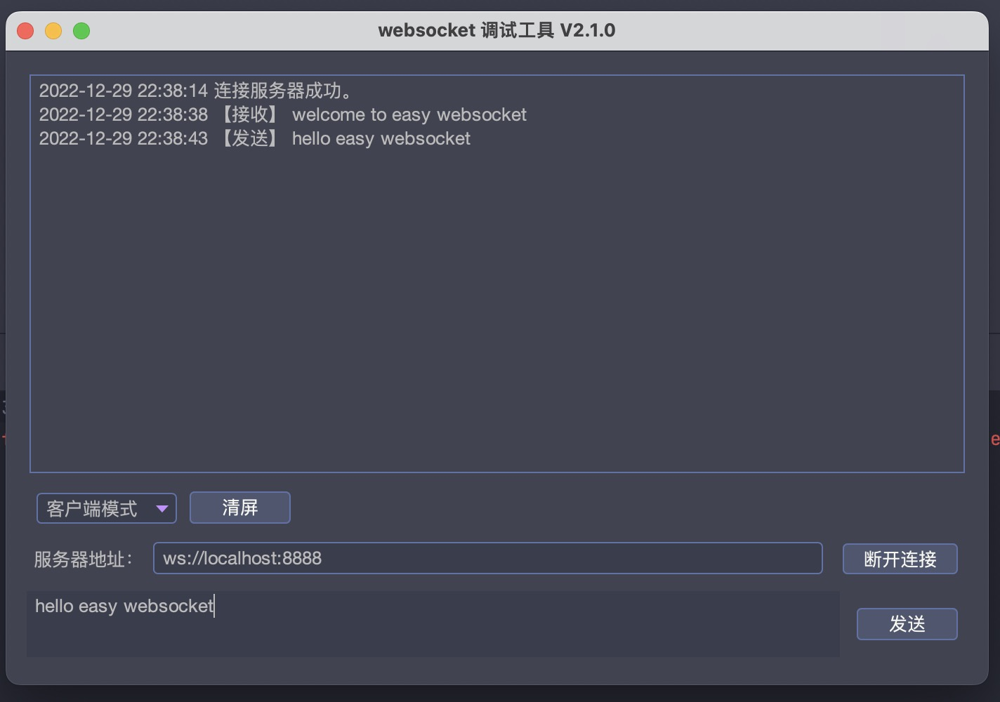
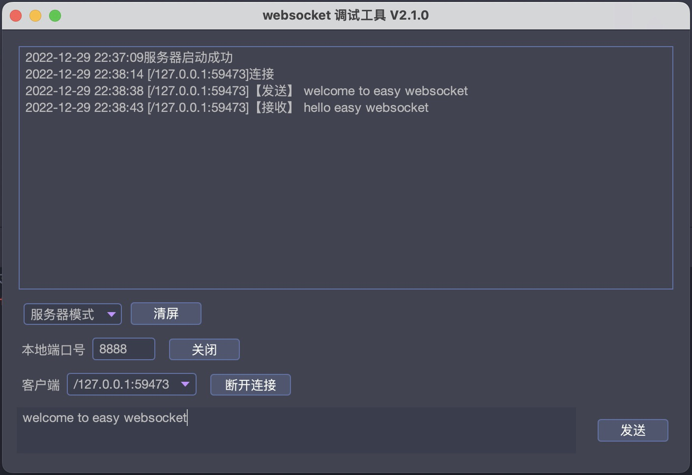

# 项目目标
该项目旨在构建一个易用的websocket调试工具，主要方便各位同学在日常开发过程中使用ws协议来测试相关的接口。
本项目致力于让websocket更加易于使用易于调试。

## 实际运行截图





## 项目打包

```shell
mvn clean package
```

## 项目运行
- 下载源码直接在idea中运行
- 直接运行jar包
- 下载打包后的exe，在对应目录中运行
- mac os 下载对应的app进行运行（未完成)
